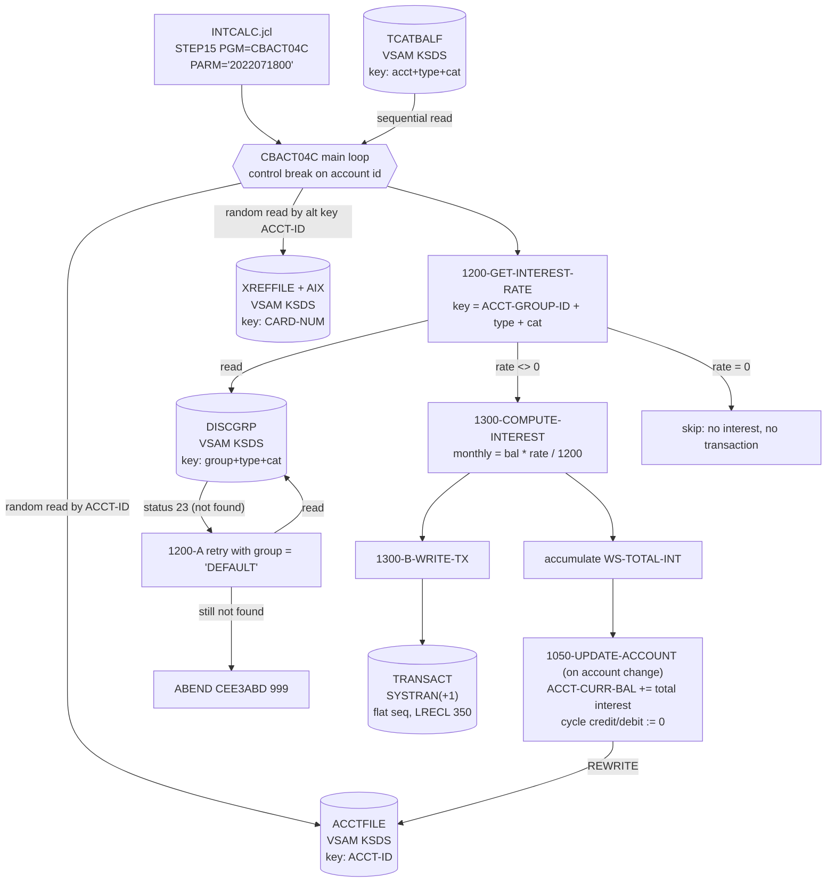

# Batch Interest Accrual (CBACT04C / INTCALC)

Source of truth: `app/cbl/CBACT04C.cbl`, `app/jcl/INTCALC.jcl`, copybooks in `app/cpy/`.

## 1. Business purpose (plain English)

Every cardholder account carries balances that are broken down by *category* of activity
(for example purchases, cash advances, fees). Money that is left owing accrues interest.

This batch job walks through every account's category balances and works out how much
interest is owed this month for each category. It looks up the interest rate that applies
to that customer's pricing group ("disclosure group") and that category of spend; if the
customer's group has no published rate for that category, it falls back to the standard
published rate. For each rate it finds, it creates an interest transaction (a line item
that will appear on the statement, described as "Int. for a/c <account>"), and it adds the
total interest for the account onto the account's current balance. It also resets the
account's cycle-to-date credit and debit totals to zero, which is the normal "start a new
billing cycle" action.

Output is a new generation of the system transaction file, which downstream jobs post and
report on. The account master file is updated in place.

## 2. Files

Run as `STEP15 EXEC PGM=CBACT04C,PARM='2022071800'` in `app/jcl/INTCALC.jcl`. The PARM is a
10-character date/run stamp used only as the prefix of generated transaction IDs.

| DD name | Dataset | Direction | Organization / access | Record key | Copybook / layout |
|---|---|---|---|---|---|
| `TCATBALF` | `AWS.M2.CARDDEMO.TCATBALF.VSAM.KSDS` | Input | VSAM KSDS (`ORGANIZATION INDEXED`), **sequential** access | `FD-TRAN-CAT-KEY` = acct-id `9(11)` + tran type `X(02)` + tran cat `9(04)` | `CVTRA01Y` — `TRAN-CAT-BAL-RECORD`, 50 bytes |
| `XREFFILE` | `AWS.M2.CARDDEMO.CARDXREF.VSAM.KSDS` | Input | VSAM KSDS, **random** access | primary `FD-XREF-CARD-NUM` `X(16)`; **alternate** `FD-XREF-ACCT-ID` `9(11)` (read via the AIX) | `CVACT03Y` — `CARD-XREF-RECORD`, 50 bytes |
| `XREFFIL1` | `AWS.M2.CARDDEMO.CARDXREF.VSAM.AIX.PATH` | Input | AIX path backing the alternate key above | `XREF-ACCT-ID` | — |
| `ACCTFILE` | `AWS.M2.CARDDEMO.ACCTDATA.VSAM.KSDS` | Input **and** output (`REWRITE`) | VSAM KSDS, random access | `FD-ACCT-ID` `9(11)` | `CVACT01Y` — `ACCOUNT-RECORD`, 300 bytes |
| `DISCGRP` | `AWS.M2.CARDDEMO.DISCGRP.VSAM.KSDS` | Input | VSAM KSDS, random access | `FD-DISCGRP-KEY` = group id `X(10)` + tran type `X(02)` + tran cat `9(04)` | `CVTRA02Y` — `DIS-GROUP-RECORD`, 50 bytes |
| `TRANSACT` | `AWS.M2.CARDDEMO.SYSTRAN(+1)` | Output | Flat sequential GDG, `RECFM=F, LRECL=350` (not VSAM) | none (sequential write) | `CVTRA05Y` — `TRAN-RECORD`, 350 bytes |

Notes:
- `TCATBALF` is read sequentially in key order, so the control break on account id relies on
  the KSDS key sequence (account id is the high-order part of the key).
- The account file is opened `I-O`; the only field group written back is balance +
  cycle credit/debit (see `1050-UPDATE-ACCOUNT`).

## 3. Interest formula and rate lookup

```
COMPUTE WS-MONTHLY-INT = ( TRAN-CAT-BAL * DIS-INT-RATE ) / 1200
```

- `TRAN-CAT-BAL` `S9(09)V99` — the balance for this account/type/category (from `TCATBALF`).
- `DIS-INT-RATE` `S9(04)V99` — the **annual percentage** rate from the disclosure group
  record (e.g. `0015.00` = 15% APR in `app/data/ASCII/discgrp.txt`).
- `1200` = 100 (percent → fraction) × 12 (annual → monthly). So this is a simple monthly
  accrual: `balance × APR% / 100 / 12`. No compounding, no day-count proration, and the
  PARM date is not used in the calculation.

Rate lookup key (`1200-GET-INTEREST-RATE`) is built from:
- `ACCT-GROUP-ID` (from the account record) → `FD-DIS-ACCT-GROUP-ID`
- `TRANCAT-TYPE-CD` (from the category balance record) → `FD-DIS-TRAN-TYPE-CD`
- `TRANCAT-CD` (from the category balance record) → `FD-DIS-TRAN-CAT-CD`

**Fallback when the disclosure group is missing:** the random `READ DISCGRP-FILE` returns
file status `23` (record not found). That status is treated as acceptable (`'00' OR '23'`),
the program displays `DISCLOSURE GROUP RECORD MISSING` / `TRY WITH DEFAULT GROUP CODE`,
moves the literal `'DEFAULT'` into `FD-DIS-ACCT-GROUP-ID`, and re-reads with the same
type/category codes (`1200-A-GET-DEFAULT-INT-RATE`). The `DEFAULT` group rows exist in
`app/data/ASCII/discgrp.txt`. If the `DEFAULT` row is also missing, status is not `00` and
the program **abends** (`CEE3ABD`, code 999) — there is no second fallback.

Caveats in the fallback path:
- On a status `23`, the `READ ... INTO DIS-GROUP-RECORD` does not deliver a record, so
  `DIS-GROUP-RECORD` still holds the **previous** iteration's values until the DEFAULT read
  succeeds and overwrites it.
- After the main loop calls `1200-GET-INTEREST-RATE`, interest is computed only
  `IF DIS-INT-RATE NOT = 0`, so a zero rate produces no transaction and no accrual.

Per-account posting (`1050-UPDATE-ACCOUNT`, run at the control break when the account id
changes): `ACCT-CURR-BAL := ACCT-CURR-BAL + WS-TOTAL-INT`, `ACCT-CURR-CYC-CREDIT := 0`,
`ACCT-CURR-CYC-DEBIT := 0`, then `REWRITE`.

Generated transaction (`1300-B-WRITE-TX`), one per category with a non-zero rate:
`TRAN-ID` = PARM date (10) + 6-digit running counter; `TRAN-TYPE-CD` `01`; `TRAN-CAT-CD`
`0005`; `TRAN-SOURCE` `System`; `TRAN-DESC` `'Int. for a/c ' + ACCT-ID`; `TRAN-AMT` =
`WS-MONTHLY-INT`; `TRAN-CARD-NUM` = `XREF-CARD-NUM`; both timestamps = current date/time in
DB2 format (not the PARM date); merchant fields zero/blank.

## 4. Data flow



## 5. Unimplemented / dead / suspect logic

1. **`1400-COMPUTE-FEES` is an empty stub** — the paragraph body is the comment
   `* To be implemented` followed by `EXIT.`. It is performed for every non-zero-rate
   category, so no fees are ever computed despite the JCL comment "compute interest and fees".
2. **The last account is never updated.** In the main loop, `1050-UPDATE-ACCOUNT` appears in
   the `ELSE` of `IF END-OF-FILE = 'N'`, but the enclosing `PERFORM UNTIL END-OF-FILE = 'Y'`
   terminates as soon as EOF is set, so that `ELSE` branch is unreachable. Interest for the
   final account in the file is written to `TRANSACT` but never added to `ACCT-CURR-BAL`.
3. **`WS-RECORD-COUNT` is incremented but never displayed or used** — dead accumulator.
4. **`WS-MISC-VARS.WS-LAST-ACCT-NUM` is `PIC X(11)`** compared against numeric
   `TRANCAT-ACCT-ID` `9(11)`; it works only because of the digit-character representation.
5. **The PARM date is only cosmetic** — it prefixes `TRAN-ID`; the accrual period, the
   transaction timestamps (`FUNCTION CURRENT-DATE`) and the formula do not use it, so a
   re-run for an old period stamps today's dates.
6. **Full-record `DISPLAY TRAN-CAT-BAL-RECORD` on every input record** — debug tracing left
   in production code; large SYSOUT volume.
7. **Commented-out debug `DISPLAY`s** for `ACCT-GROUP-ID`, `TRANCAT-CD`, `TRANCAT-TYPE-CD`
   remain in the main loop.
8. **`FD-ACCT-DATA` is declared twice** (in the `ACCOUNT-FILE` and `TRANSACT-FILE` FDs) —
   both records are written via `FROM`/`INTO` working-storage areas, so the FD fields other
   than the keys are effectively unused filler.
9. **No restart/idempotency control** — re-running the job accrues interest again onto
   `ACCT-CURR-BAL` and writes a new generation of duplicate interest transactions.
10. **Stale `DIS-GROUP-RECORD` on lookup failure** (see §3) — if the DEFAULT read ever
    succeeded with a stale buffer path, the previous category's rate could be used; today
    the abend path prevents this, but the buffer is not cleared defensively.
