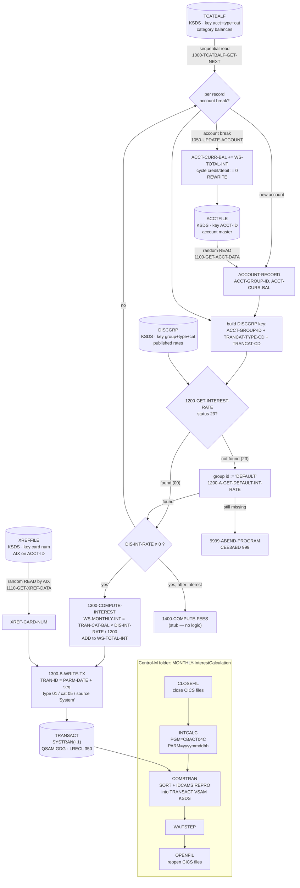

# Batch Interest Accrual Flow (`INTCALC` / `CBACT04C`)

Entry points: [`app/jcl/INTCALC.jcl`](../app/jcl/INTCALC.jcl) → [`app/cbl/CBACT04C.cbl`](../app/cbl/CBACT04C.cbl)

---

## 1. Business purpose (plain English)

Once a month, CardDemo has to charge cardholders interest on the balances they
are carrying. This job is the step that does it.

Every account's balance is stored broken down into buckets — a bucket per kind of
activity (for example "purchases", "cash advances", "balance transfers"). Each
bucket is a row in the *transaction category balance* file.

For each bucket the job:

1. looks up which pricing plan ("disclosure group") the account belongs to,
2. finds the published annual interest rate for that plan and that bucket,
3. works out one month's worth of interest on the bucket's balance,
4. writes an interest charge as a new transaction ("Int. for a/c 12345678901"),
   so the cardholder can see the charge on their statement, and
5. adds the total interest for the account onto the account's current balance and
   resets the account's cycle-to-date credit and debit totals to zero, ready for
   the new billing cycle.

If an account belongs to a pricing plan that has no published rate on file, the
job falls back to a plan literally named `DEFAULT` rather than skipping the
account.

The interest transactions produced here are written to a new generation of the
system-transaction file. Later jobs in the monthly stream merge them into the
transaction master so they show up online in CICS. The Control-M folder
`MONTHLY-InterestCalculation` runs
`CLOSEFIL → INTCALC → COMBTRAN → WAITSTEP → OPENFIL`
(see [`app/scheduler/CardDemo.controlm`](../app/scheduler/CardDemo.controlm)),
so CICS files are closed for the duration of the run and reopened afterwards.
The equivalent hand-driven stream in
[`scripts/run_interest_calc.sh`](../scripts/run_interest_calc.sh) differs: it
submits `CLOSEFIL → INTCALC → TRANBKP → COMBTRAN → TRANIDX → OPENFIL`, i.e. it
adds `TRANBKP` (back up the transaction master) and `TRANIDX` (rebuild its
alternate index), and has no `WAITSTEP`.

---

## 2. Inputs and outputs

Program parameter: `PARM='2022071800'` — a 10-character value received as
`PARM-DATE` in the `LINKAGE SECTION`. It is used **only** as the high-order part
of generated transaction IDs (see §5).

| DD name | Dataset (from JCL) | Access in program | Organization | Record key | LRECL / layout |
|---|---|---|---|---|---|
| `TCATBALF` | `AWS.M2.CARDDEMO.TCATBALF.VSAM.KSDS` | `OPEN INPUT`, sequential read (driving file) | VSAM KSDS, `ACCESS MODE IS SEQUENTIAL` | `FD-TRAN-CAT-KEY` = `TRANCAT-ACCT-ID PIC 9(11)` + `TRANCAT-TYPE-CD PIC X(02)` + `TRANCAT-CD PIC 9(04)` (17 bytes) | 50 — copybook `CVTRA01Y` |
| `XREFFILE` | `AWS.M2.CARDDEMO.CARDXREF.VSAM.KSDS` | `OPEN INPUT`, random read **by alternate key** | VSAM KSDS, `ACCESS MODE IS RANDOM` | Primary `FD-XREF-CARD-NUM PIC X(16)`; alternate `FD-XREF-ACCT-ID PIC 9(11)` | 50 — copybook `CVACT03Y` |
| `XREFFIL1` | `AWS.M2.CARDDEMO.CARDXREF.VSAM.AIX.PATH` | not coded explicitly | VSAM alternate-index PATH | account id | — |
| `ACCTFILE` | `AWS.M2.CARDDEMO.ACCTDATA.VSAM.KSDS` | `OPEN I-O`, random `READ` + `REWRITE` (**updated in place**) | VSAM KSDS, `ACCESS MODE IS RANDOM` | `FD-ACCT-ID PIC 9(11)` | 300 — copybook `CVACT01Y` |
| `DISCGRP` | `AWS.M2.CARDDEMO.DISCGRP.VSAM.KSDS` | `OPEN INPUT`, random read | VSAM KSDS, `ACCESS MODE IS RANDOM` | `FD-DISCGRP-KEY` = `DIS-ACCT-GROUP-ID PIC X(10)` + `DIS-TRAN-TYPE-CD PIC X(02)` + `DIS-TRAN-CAT-CD PIC 9(04)` (16 bytes) | 50 — copybook `CVTRA02Y` |
| `TRANSACT` | `AWS.M2.CARDDEMO.SYSTRAN(+1)` | `OPEN OUTPUT`, sequential `WRITE` | Non-VSAM QSAM GDG generation, `RECFM=F`, sequential | **no key** | 350 — copybook `CVTRA05Y` |
| `SYSOUT` / `SYSPRINT` | `SYSOUT=*` | `DISPLAY` output | — | — | — |

Notes:

* `XREFFIL1` is the alternate-index path DD that the COBOL runtime requires so
  `READ XREF-FILE ... KEY IS FD-XREF-ACCT-ID` works; there is no matching
  `SELECT` for it.
* `TRANSACT` is the only *created* dataset (`DISP=(NEW,CATLG,DELETE)`); the
  account master is the only dataset updated in place.
* The cross-reference read exists purely to obtain the card number stamped onto
  the interest transaction.

---

## 3. The interest formula and where the rate comes from

### Formula

`1300-COMPUTE-INTEREST` (`app/cbl/CBACT04C.cbl`):

```cobol
COMPUTE WS-MONTHLY-INT = ( TRAN-CAT-BAL * DIS-INT-RATE) / 1200
ADD WS-MONTHLY-INT TO WS-TOTAL-INT
```

* `TRAN-CAT-BAL` `PIC S9(09)V99` — the balance of one transaction category bucket.
* `DIS-INT-RATE` `PIC S9(04)V99` — the **annual** rate as a percentage (e.g.
  `0015.00` = 15%, the value carried in `app/data/ASCII/discgrp.txt`).
* Dividing by `1200` = divide by 100 (percent → fraction) and by 12
  (annual → one month). So: **monthly interest = bucket balance × annual rate % ÷ 1200**.
* `WS-MONTHLY-INT` `PIC S9(09)V99` — result truncated to 2 decimals, no explicit
  `ROUNDED` clause, so the third decimal and beyond are dropped.
* There is no day-count or proration: every run charges exactly one twelfth of
  the annual rate regardless of the `PARM` date or when the job last ran.

Per-bucket amounts accumulate in `WS-TOTAL-INT` and are applied to the account
once, at the account break, in `1050-UPDATE-ACCOUNT`:

```cobol
ADD WS-TOTAL-INT TO ACCT-CURR-BAL
MOVE 0 TO ACCT-CURR-CYC-CREDIT
MOVE 0 TO ACCT-CURR-CYC-DEBIT
REWRITE FD-ACCTFILE-REC FROM ACCOUNT-RECORD
```

Ordering matters here: at an account break `1050-UPDATE-ACCOUNT` runs *before*
`MOVE TRANCAT-ACCT-ID TO FD-ACCT-ID` and `1100-GET-ACCT-DATA`, so the `REWRITE`
still targets the previous account, whose record is the one currently in
`ACCOUNT-RECORD`.

### Where the rate comes from

The rate is read from the disclosure-group KSDS in `1200-GET-INTEREST-RATE`,
keyed by three fields assembled in the main loop:

| Key part | Source |
|---|---|
| `FD-DIS-ACCT-GROUP-ID` | `ACCT-GROUP-ID` from the account master record |
| `FD-DIS-TRAN-TYPE-CD` | `TRANCAT-TYPE-CD` from the current category-balance record |
| `FD-DIS-TRAN-CAT-CD` | `TRANCAT-CD` from the current category-balance record |

So the rate is per (pricing plan × transaction type × transaction category), not
per account.

### Fallback when the disclosure group is missing

```cobol
READ DISCGRP-FILE INTO DIS-GROUP-RECORD
     INVALID KEY
        DISPLAY 'DISCLOSURE GROUP RECORD MISSING'
        DISPLAY 'TRY WITH DEFAULT GROUP CODE'
END-READ.
...
IF DISCGRP-STATUS = '00' OR '23'   *> '23' (not found) is tolerated
    MOVE 0 TO APPL-RESULT
...
IF DISCGRP-STATUS = '23'
    MOVE 'DEFAULT' TO FD-DIS-ACCT-GROUP-ID
    PERFORM 1200-A-GET-DEFAULT-INT-RATE
END-IF
```

1. Read the rate with the account's own group id.
2. File status `23` (record not found) is *not* an error: the group id in the key
   is replaced with the literal `'DEFAULT'` (the transaction type and category
   parts of the key are left as-is) and the read is retried in
   `1200-A-GET-DEFAULT-INT-RATE`.
3. `app/data/ASCII/discgrp.txt` ships a `DEFAULT` row for every type/category
   combination *that appears in that file*, and the only combination present in
   `app/data/ASCII/tcatbal.txt` is `01/0001`, so the fallback always resolves
   with the shipped data. A category-balance row carrying a type/category pair
   absent from the rate file would still hit the abend path in step 4.
4. If the retry does **not** find a `DEFAULT` row, `1200-A-GET-DEFAULT-INT-RATE`
   has no `INVALID KEY` clause and status `23` fails the `= '00'` test →
   `APPL-RESULT 12` → `9999-ABEND-PROGRAM` (`CEE3ABD`, abend code 999). A
   missing `DEFAULT` row therefore abends the job rather than skipping the bucket.
5. Back in the main loop, interest is computed only when a rate was found and is
   non-zero:

   ```cobol
   IF DIS-INT-RATE NOT = 0
     PERFORM 1300-COMPUTE-INTEREST
     PERFORM 1400-COMPUTE-FEES
   END-IF
   ```

   A zero rate (many `DEFAULT` type `02`/`03` rows are `0000.00`) produces no
   interest transaction at all.

---

## 4. Data-flow diagram



---

## 5. Unimplemented and dead logic

1. **`1400-COMPUTE-FEES` is an empty stub.** The paragraph body is the comment
   `* To be implemented` followed by `EXIT.` — yet both the JCL header ("compute
   interest and fees") and the main loop call it. No fees are ever calculated or
   posted.

2. **The last account never gets its balance updated (dead `ELSE` branch).** The
   main loop is:

   ```cobol
   PERFORM UNTIL END-OF-FILE = 'Y'
       IF END-OF-FILE = 'N'
           ... process record ...
       ELSE
           PERFORM 1050-UPDATE-ACCOUNT      *> unreachable
       END-IF
   END-PERFORM
   ```

   `END-OF-FILE` can only become `'Y'` inside the `IF` branch, and the `PERFORM
   UNTIL` test then ends the loop before the `ELSE` can run. `1050-UPDATE-ACCOUNT`
   therefore only ever fires on an *account break*, so the accumulated
   `WS-TOTAL-INT` for the final account on the file is silently discarded — its
   interest transactions are written but `ACCT-CURR-BAL` is not increased and its
   cycle totals are not reset.

3. **`WS-RECORD-COUNT` is dead.** Incremented for every input record and never
   displayed, tested, or written.

4. **`PARM-LENGTH` is unused, and `PARM-DATE` is not used as an accrual date.**
   The parameter only prefixes generated transaction IDs
   (`STRING PARM-DATE, WS-TRANID-SUFFIX ... INTO TRAN-ID`, i.e. 10 characters of
   date + a 6-digit counter = the 16-byte `TRAN-ID`). Nothing validates the
   parameter's length or contents, and the shipped JCL hardcodes
   `PARM='2022071800'`, so reruns without editing the JCL regenerate the same
   transaction IDs. `WS-TRANID-SUFFIX PIC 9(06)` is likewise never reset and
   wraps silently after 999,999 interest transactions in a single run — the other
   way duplicate `TRAN-ID`s can arise.

5. **No rerun / restart protection.** Category balances in `TCATBALF` are never
   reset or flagged, and the account `REWRITE` is not coordinated with the
   transaction writes, so running the job twice for the same cycle double-charges
   interest.

6. **"Not found" handling is effectively an abend, not a soft skip.**
   `1100-GET-ACCT-DATA` and `1110-GET-XREF-DATA` display `ACCOUNT NOT FOUND` in
   their `INVALID KEY` clauses, but control then falls into the
   `IF ... STATUS = '00' ... ELSE MOVE 12` check, which abends. The messages can
   therefore never be followed by continued processing.

7. **Debug output left enabled / commented out.** `DISPLAY TRAN-CAT-BAL-RECORD`
   dumps every input record to SYSOUT on every run, and there are commented-out
   `DISPLAY` statements for `ACCT-GROUP-ID`, `TRANCAT-CD`, `TRANCAT-TYPE-CD` and
   `DB2-TIMESTAMP`.

8. **Cycle-total reset is bundled into the interest job.** `1050-UPDATE-ACCOUNT`
   zeroes `ACCT-CURR-CYC-CREDIT` / `ACCT-CURR-CYC-DEBIT`. That is a billing-cycle
   reset, not interest accrual, and it happens even for accounts whose interest
   came out as zero.

9. **Duplicated / misleading data names in the `FILE SECTION`.**
   `FD-ACCT-DATA` is defined in both `FD ACCOUNT-FILE` (`PIC X(289)`) and
   `FD TRANSACT-FILE` (`PIC X(334)`), and `FD-FD-TRAN-CAT-DATA` carries a doubled
   prefix. All record I/O goes through the copybook layouts, so these `FD` filler
   fields are never referenced.

10. **Stale-rate exposure.** `DIS-GROUP-RECORD` is a working-storage area reused
    across iterations. On a status `23` read it is left untouched, and correctness
    depends entirely on the `DEFAULT` retry either overwriting it or abending — no
    field is cleared before the read.
