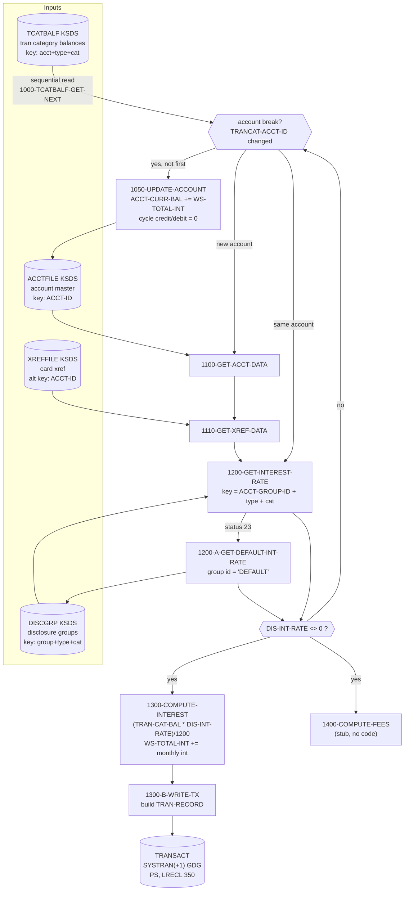

# Batch Interest Accrual (INTCALC / CBACT04C)

Source of truth: `app/cbl/CBACT04C.cbl`, `app/jcl/INTCALC.jcl`, copybooks in `app/cpy/`.

## 1. Business purpose (plain English)

Each cycle the bank has to charge customers interest on the balances they carry.
A cardholder's balance is not held as one lump sum: it is split into *categories*
(for example purchases, cash advances, balance transfers), and each category can
carry a different interest rate.

This job walks through every account's category balances, looks up the interest
rate that applies to that customer's pricing group and that category, works out
one month of interest on each category balance, and then:

* writes one new "interest" transaction record per category, so the charge shows
  up on the customer's statement with a description like `Int. for a/c 12345678901`; and
* adds all of the interest for the account to the account's current balance, and
  resets the account's cycle-to-date credit and debit totals to zero, i.e. starts
  a fresh billing cycle.

Business outcome: interest is billed, statements have an auditable line item for
it, and the account is rolled into the next cycle.

## 2. Files

Run under `app/jcl/INTCALC.jcl`, step `STEP15`, `PGM=CBACT04C,PARM='2022071800'`.

| DD name | Dataset | Organization / access | Record key | Open mode | Copybook / layout | Role |
|---|---|---|---|---|---|---|
| `TCATBALF` | `AWS.M2.CARDDEMO.TCATBALF.VSAM.KSDS` | VSAM KSDS (`ORGANIZATION INDEXED`, `ACCESS SEQUENTIAL`) | `TRAN-CAT-KEY` = acct-id `9(11)` + type-cd `X(02)` + cat-cd `9(04)` (KSDS `KEYS(17 0)`, RECORDSIZE 50) | INPUT | `CVTRA01Y` | Driving file: transaction category balances |
| `XREFFILE` | `AWS.M2.CARDDEMO.CARDXREF.VSAM.KSDS` | VSAM KSDS (`INDEXED`, `ACCESS RANDOM`) | Primary `XREF-CARD-NUM X(16)`; alternate `XREF-ACCT-ID 9(11)` (AIX, read via `KEY IS FD-XREF-ACCT-ID`) | INPUT | `CVACT03Y` | Account -> card number lookup for the generated transaction |
| `XREFFIL1` | `AWS.M2.CARDDEMO.CARDXREF.VSAM.AIX.PATH` | VSAM AIX path over the xref cluster | alt key `XREF-ACCT-ID` | allocated only | – | Allocated by the JCL; the program has no `SELECT` for it (see §5) |
| `ACCTFILE` | `AWS.M2.CARDDEMO.ACCTDATA.VSAM.KSDS` | VSAM KSDS (`INDEXED`, `ACCESS RANDOM`) | `ACCT-ID 9(11)` (RECLN 300) | **I-O** (read + `REWRITE`) | `CVACT01Y` | Account master; balance updated in place |
| `DISCGRP` | `AWS.M2.CARDDEMO.DISCGRP.VSAM.KSDS` | VSAM KSDS (`INDEXED`, `ACCESS RANDOM`) | `DIS-GROUP-KEY` = group-id `X(10)` + type-cd `X(02)` + cat-cd `9(04)` (KSDS `KEYS(16 0)`, RECORDSIZE 50) | INPUT | `CVTRA02Y` | Disclosure (pricing) group -> interest rate |
| `TRANSACT` | `AWS.M2.CARDDEMO.SYSTRAN(+1)` — new GDG generation | Physical sequential, `RECFM=F,LRECL=350` (`ORGANIZATION SEQUENTIAL`) | n/a | OUTPUT | `CVTRA05Y` | Newly generated interest transactions |

`STEPLIB` is `AWS.M2.CARDDEMO.LOADLIB`; `SYSOUT`/`SYSPRINT` receive the `DISPLAY` trace
(the program displays every `TRAN-CAT-BAL-RECORD` it reads).

## 3. Interest formula and rate sourcing

Per transaction-category balance record:

```
WS-MONTHLY-INT = (TRAN-CAT-BAL * DIS-INT-RATE) / 1200
```

* `TRAN-CAT-BAL` — `S9(09)V99`, the category balance from `TCATBALF`.
* `DIS-INT-RATE` — `S9(04)V99`, an **annual percentage rate** from the disclosure
  group record. Dividing by 1200 converts "annual percent" to "monthly fraction"
  (`/100` for percent, `/12` for one month).
* `WS-MONTHLY-INT` accumulates into `WS-TOTAL-INT` for the account and is written
  as `TRAN-AMT` on the generated transaction (`TRAN-TYPE-CD = '01'`,
  `TRAN-CAT-CD = '05'`, `TRAN-SOURCE = 'System'`).
* At the account break, `1050-UPDATE-ACCOUNT` does `ADD WS-TOTAL-INT TO ACCT-CURR-BAL`
  and zeroes `ACCT-CURR-CYC-CREDIT` / `ACCT-CURR-CYC-DEBIT`.

There is no day-count proration: every run charges exactly one month, regardless of
the `PARM` date or the previous run date.

### Where the rate comes from

The lookup key into `DISCGRP` is built in the mainline:

```
FD-DIS-ACCT-GROUP-ID <- ACCT-GROUP-ID      (from the account master record)
FD-DIS-TRAN-TYPE-CD  <- TRANCAT-TYPE-CD    (from the tcatbal record)
FD-DIS-TRAN-CAT-CD   <- TRANCAT-CD         (from the tcatbal record)
```

`1200-GET-INTEREST-RATE` reads `DISCGRP` randomly on that key.

### Fallback when the account's disclosure group is missing

`1200-GET-INTEREST-RATE` treats file status `23` (record not found) as an accepted
status, not an error. On `23` it displays `DISCLOSURE GROUP RECORD MISSING` /
`TRY WITH DEFAULT GROUP CODE`, moves the literal `'DEFAULT'` into
`FD-DIS-ACCT-GROUP-ID` (keeping the same type-cd and cat-cd) and performs
`1200-A-GET-DEFAULT-INT-RATE`, which re-reads `DISCGRP` on the `DEFAULT` key.
`app/data/ASCII/discgrp.txt` ships 17 `DEFAULT` rows covering the standard
type/category combinations.

If the `DEFAULT` read also fails, the status is not `00`, so `1200-A` aborts the job
via `9999-ABEND-PROGRAM` (`CEE3ABD`, code 999).

After the lookup, interest is computed only `IF DIS-INT-RATE NOT = 0`, so a
zero-rate category produces no transaction and no balance change.

## 4. Data flow



## 5. Unimplemented, dead, or defective logic

1. **`1400-COMPUTE-FEES` is an empty stub** — body is the comment `* To be implemented`
   followed by `EXIT.`. Fees are never calculated despite being advertised in the JCL
   comment ("compute interest and fees").
2. **The last account of the file is never updated.** The mainline's `ELSE PERFORM
   1050-UPDATE-ACCOUNT` sits under `IF END-OF-FILE = 'N'`, but the enclosing
   `PERFORM UNTIL END-OF-FILE = 'Y'` exits as soon as EOF is set, so that `ELSE`
   branch is unreachable. Interest transactions for the final account are still
   written to `TRANSACT`, but its `ACCT-CURR-BAL` is never rewritten — the account
   file and the transaction file disagree for that account.
3. **`DIS-INT-RATE` is not reset between records.** If a `DISCGRP` read leaves the
   record area untouched, the previously read rate stays in `DIS-GROUP-RECORD` and
   is silently reused for the next category.
4. **Non-zero `INVALID KEY` conditions are only displayed, then re-checked.**
   `1100-GET-ACCT-DATA` / `1110-GET-XREF-DATA` display `ACCOUNT NOT FOUND` and then
   abend on the same non-`00` status, so the friendly message is effectively just a
   prelude to an abend; there is no skip-and-continue path.
5. **`XREFFIL1` DD is unused.** `INTCALC.jcl` allocates the AIX path dataset, but
   `CBACT04C` has no `SELECT` assigned to `XREFFIL1`; the alternate key is reached
   through the base cluster's `ALTERNATE RECORD KEY` instead.
6. **`PARM-DATE` is only used as a transaction-id prefix.** The `PARM='2022071800'`
   value never influences accrual dates, proration, or the transaction timestamps
   (`TRAN-ORIG-TS` / `TRAN-PROC-TS` come from `FUNCTION CURRENT-DATE`). `PARM-LENGTH`
   is never inspected, so a missing/short parm is not validated.
7. **`TRAN-ID` construction is fragile.** `STRING PARM-DATE, WS-TRANID-SUFFIX` yields
   a 16-char id from a 10-char date plus a 6-digit counter; the counter is a single
   run-wide sequence with no wrap handling beyond `9(06)`.
8. **`WS-LAST-ACCT-NUM` is `PIC X(11)` compared against a `9(11)` field** — the
   comparison works for the shipped data but is a type mismatch, and the
   `WS-FIRST-TIME` flag exists only to suppress an update before the first account
   is loaded.
9. **Dead/commented tracing**: `DISPLAY 'ACCT-GROUP-ID: '…`, `TRANCAT-CD`,
   `TRANCAT-TYPE-CD` and `DB2-TIMESTAMP` displays are commented out; `Z-GET-DB2-FORMAT-TIMESTAMP`
   builds a DB2 timestamp although the program has no DB2 access.
10. **`TRANSACT` is opened `OUTPUT` unconditionally**, so a rerun always creates a new
    GDG generation; there is no restart/checkpoint logic, and a mid-run abend leaves
    the account master partially updated with no compensating action.
